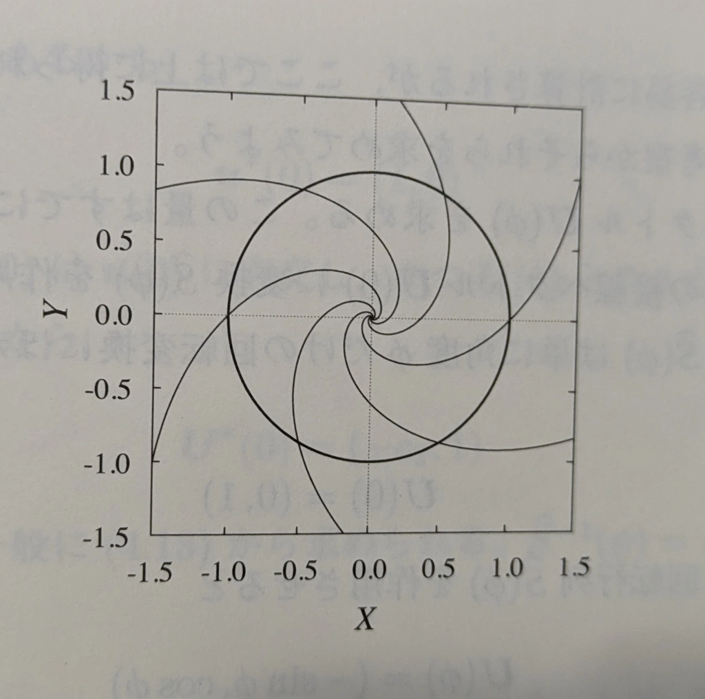
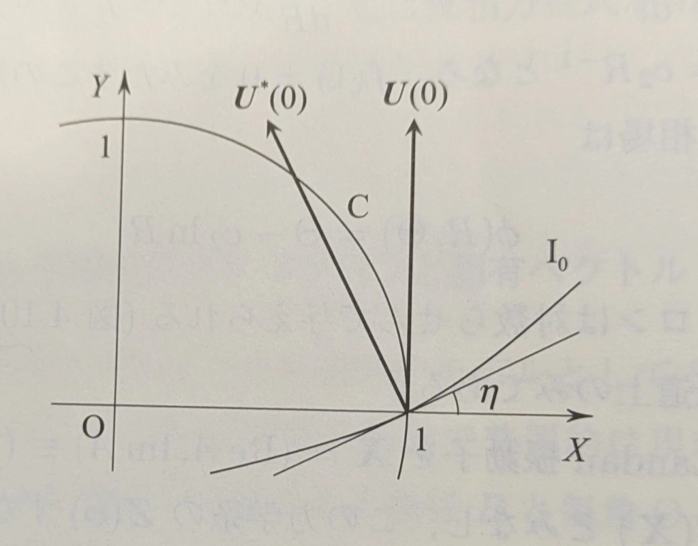
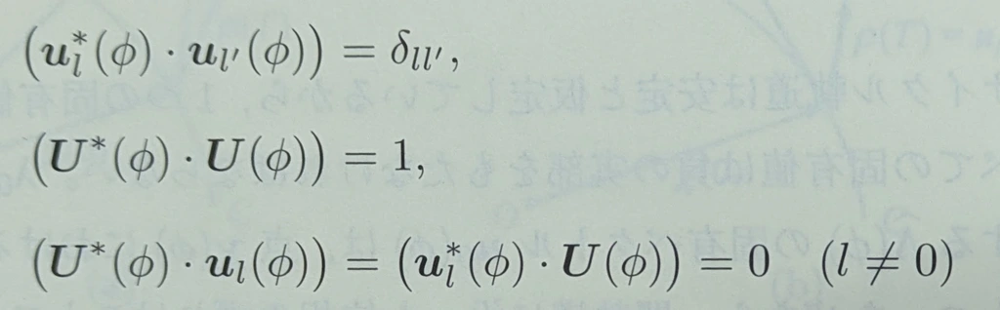

**同期現象の科学**
# 第4章 位相記述法 4.5

多田 瑛貴
公立はこだて未来大学 システム情報科学部
複雑系知能学科 複雑系コース 3年

*写真: 北海道厚岸郡厚岸町*

---

# Stuart-Landau振動子のアイソクロンと固有ベクトル

---

## Stuart-Landau振動子について

$$
\frac{dA}{dt} = (1 + ic_0)A - (1 + ic_2)|A|^2A
$$

円軌道のリミットサイクルに収束 *Aは複素変数*

*図: 2次元相空間$(\mathrm{Re}A, \mathrm{Im}A)\equiv(X,Y)$上の軌跡と
以降で求めるアイソクロン*

---
極座標として、動径$R$・偏角$\Theta$を用いて表すために、次のような変換を行う

$$A=R\exp{i\Theta}$$

これにより、時間発展を次のように表せる

$$
\begin{aligned}
\frac{dR}{dt}&=R-R^3 \\
\frac{d\Theta}{dt}&=c_0-c_2R^2
\end{aligned}
$$

このとき、リミットサイクルは次のようになる

$$
\begin{aligned}
R&=1 \\
\Theta&=(c_0-c_2)t
\end{aligned}
$$

*2章3節「普遍的な振動子」より。導出は2章3節にて*

---

## Stuart-Landau振動子のアイソクロン

リミットサイクルは円軌道のため、その上では偏角=位相と言える
一方で、大域的な位相$\phi$が偏角$\Theta$とは限らない 

位相場$\phi(R, \Theta)$を求めてみたい

---

系の回転対称性から、位相場は

$\phi = \Theta-f(R)$

の形をもつと期待 *つまり (位相)=(偏角)+任意関数(動径)*

---

リミットサイクル上では
$R=1$より$\phi = \Theta$が成り立つから
$f(1) = \Theta-\phi$ から$f(1)=0$

加えて$\Theta=(c_0-c_2)t$より、$\dot{\phi}=c_0-c_2$が恒久的に成り立つから

$$\dot{\phi}=\frac{d\Theta}{dt}-\frac{df}{dR}\frac{dR}{dt}=c_0-c_2R^2-\frac{df}{dR}(R-R^3)$$
と比較し

$$\frac{df}{dR}=c_2R^{-1}$$

$f(1)=0$を満たすこの解は

$$f(R)=c_2\ln{R}$$

---

よって位相場は

$$\phi(R, \Theta)=\Theta-c_2 \ln{R}$$

アイソクロンは対数らせん

---

## Stuart-Landau振動子の位相方程式

Stuart-Landau振動子を
*これまでの図のように...*

$\mathbf{X}=(\mathrm{Re}A, \mathrm{Im}A)\equiv(X,Y)$

に対する2次元力学系$\dot{\mathbf{X}}=\mathbf{F}(\mathbf{X})$とみなし、
この力学系の$\mathbf{Z}(\phi)$を求めたい

---

## 復習: $\mathbf{Z}(\phi)$ を思い出す

閉軌道$C$上の点$\chi(\phi)$で計算された位相勾配ベクトル
つまり

$$\left. \mathrm{grad}_\mathbf{X}\phi \right|_{\mathbf{X}=\chi(\phi)} = \mathbf{Z}(\phi)$$

- 位相勾配ベクトルは、位相場の最急上昇方向
- $\chi(\phi)$における閉軌道$C$の接線ベクトルである
  零固有ベクトル$U(\phi)=d\chi(\phi)/d\phi$と直交する
  **左零固有ベクトル$U^*(\phi)$と同一** (4章2節で後半を参照)

---

## 復習: $\mathbf{Z}(\phi)$ を思い出す

時間的に変動する弱い摂動$\mathbf{p}(t)$をおくと
位相の発展方程式は

$$\frac{d\phi}{dt}=\omega+\mathrm{grad}_\mathbf{X}\phi\cdot\mathbf{p}(t)$$

摂動が十分に小さいと仮定することで

$$\frac{d\phi}{dt}=\omega+\mathbf{Z}(\phi)\cdot\mathbf{p}(t)$$

自然振動子$\omega$と位相感受性$\mathbf{Z}(\phi)$ の2つの量で、位相の発展を記述する
*振動子が閉軌道から大きく離れない限り、振動子をよく記述できる*

---

## Stuart-Landau振動子の位相方程式

*復習: $U(\phi)$は、閉軌道$C$上の点$\chi(\phi)$での接線ベクトル*

$U(\phi)$は、$U(0)=(0,1)$に回転変換をかけたもの
つまり回転行列を
$$
\hat{S}=
\begin{pmatrix}
\cos\phi & -\sin\phi \\
\sin\phi & \cos\phi
\end{pmatrix}
$$

として、次のように定まる

$$U(\phi)=\hat{S}U(0)=(-\sin\phi, \cos\phi)$$

---

位相0のアイソクロン$I_0$と$C$の交点$(1,0)$における$I_0$の接線が$X$軸となす角を$\eta$とすると、$I_0$に沿って

$$\left. \frac{d\Theta}{dR} \right|_{R=1} =c_2 = \tan\eta$$

が成り立つ

*$\left. \frac{d\Theta}{dR} \right|_{R=1}$ はつまり、$R$の変動に対する同じ位相での$\Theta$の変化
$(左辺)=c_2$は、位相場の定義$\phi=\Theta-c_2 \ln{R}$から$\phi=0$のときの$\Theta$を求め、Rで微分すると得られる*

---

$$
\begin{aligned}
\frac{dR}{dt}&=R-R^3 \\
\frac{d\Theta}{dt}&=c_0-c_2R^2
\end{aligned}
$$

この系の固定値は$\lambda = 0,-2$

$\lambda = -2$に対応する固有ベクトルはこの$I_0$に沿うベクトルであるため
これを$\mathbf{u}(0)$として
$$\mathbf{u}(0)=(1,\tan\eta)=(1,c_2)$$

*無駄口: $\lambda = 0$の場合の固有ベクトルは、零固有ベクトル $U(\phi)$*

---

系の左固有ベクトルとして $\mathbf{u}^*(\phi)$ および $\mathbf{U}^*(\phi)$ (左零固有ベクトル) を求めたい

ここで、規格直交条件より

となり、さらにこの条件から、各左固有ベクトルについて以下が成り立つ

$$\mathbf{u}^*(\phi)=\mathbf{u}^*(0)\hat{S}^{-1}$$

*4章2節を参照* 

---

これにより、以下のように求められる

- $\mathbf{u}^*(0) は \mathbf{U}(0)$ に直交し、かつ$\mathbf{u}(0)$とのスカラー積は1
  
  よって $\mathbf{u}^*(0)=(1,0)$

- $\mathbf{U}^*(0) は \mathbf{u}(0)$ に直交し、かつ$\mathbf{U}(0)$とのスカラー積は1
  
  よって$\mathbf{U}^*(0)=(-c_2, 1)$

---

回転行列$\hat{S}(\phi)$の定義から、$\hat{S}^{-1}(\phi)=\hat{S}(-\phi)$が定まる

これを用いて

$$
\begin{aligned}
\mathbf{U}^*(\phi)=\mathbf{Z}(\phi)$&=\mathbf{U}^*(0)\hat{S}^{-1} \\
&=(-\sin\phi-c_2\cos\phi, \cos\phi-c_2\sin\phi)
\end{aligned}
$$

となる

---

# まとめ

Stuart-Landau振動子は、アイソクロンが解析的に導出可能

よって順に、以下を導出
- 位相場
- アイソクロン
- 右・左固有ベクトル

これを使って、位相感受性を得ることができた
