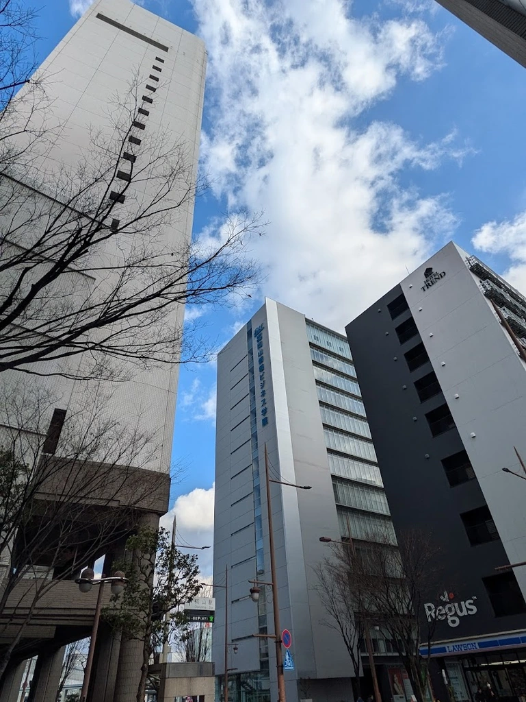
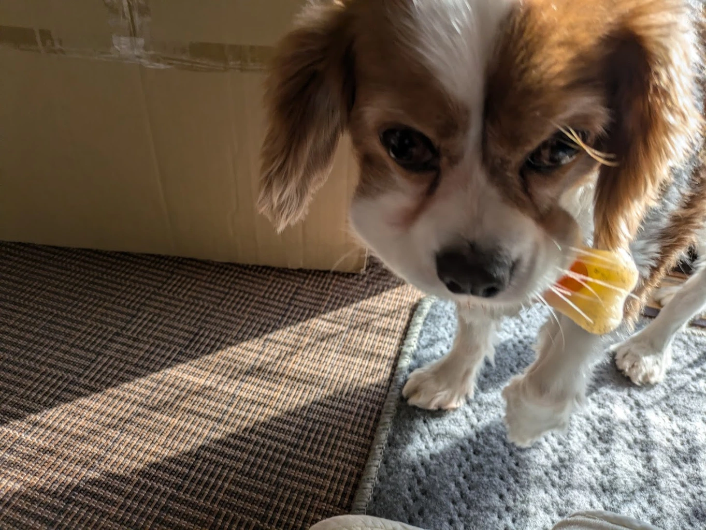
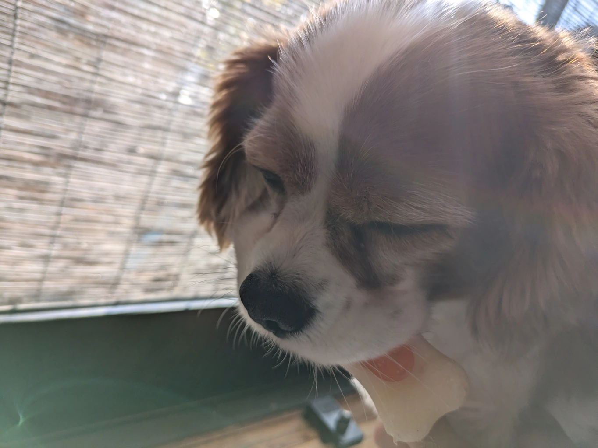

# 学習物理学入門 A4.1-A4.2
**古典力学と機械学習:NNと微分方程式**

多田 瑛貴
公立はこだて未来大学 システム情報科学部
複雑系知能学科 複雑系コース 3年

*写真: 岡山県岡山市*

---

# はじめに

---

## 前回の復習

- 勾配降下法
  - パラメータの調整法
  - 局所最適解を防ぐアプローチ
    - 確率的勾配降下法 (SGD)、ミニバッチ勾配降下法
    - Adamなどの最適化手法
- 活性化関数
  - シグモイド関数、ReLU関数、ソフトマックス関数
- 誤差逆伝播法 ($\simeq$ 連鎖律)
  - 出力とデータとの誤差の逆方向の伝播により、勾配を高速に計算
- 勾配消失問題 (特にシグモイド関数) とその解決策
  - 入力層近くでの学習が進まない問題
  - 解決策: ReLU関数、残差接続 (A4.3.3のResNetの節で詳説)

---

# 物理の基礎方程式と機械学習

---

## 微分方程式の位置づけ

古典物理学の法則はおよそ、保存則と運動方程式によって記述される

運動方程式はもちろん、保存則も多くの場合微分方程式で記述される
*例: 流体力学における連続方程式 (質量保存則) $\frac{\partial \rho}{\partial t} + \nabla \cdot (\rho \mathbf{v}) = 0$*

その理由は、物理学の根底となる局所性の原理による
*局所性: ある時刻や地点での物理量は、その(時間や空間上の)点の近傍のみに依存*

したがって、微分方程式と機械学習の関係を明らかにすることは
物理学と機械学習の関係を理解する上で重要である

---

## 順問題と逆問題

微分方程式を扱う2つの立場

- 順問題: 微分方程式が与えられた状態で、その解を求める問題
- 逆問題: 解の挙動から、従う法則を推定する問題

---

# 物理知NN

微分方程式の順問題を解く機械学習の一種

---

万能近似定理により*A2を参照*
どんな関数も十分幅の広いNNなら近似できると仮定できる

そこで、任意のNNを設け、その出力を$f(t,\mathbf{x})$とする
*$(t,\mathbf{x} )$は時間と空間の座標であり、$f$は場(時空座標の関数)であると捉えられる*

このNNを与えられた微分方程式に従わせる

---

つまり、出力$f$が満たすべき条件を、微分方程式にあわせて次のように書く:

$$ \frac{\partial f}{\partial t} = F(t, \mathbf{x}, f)  $$

例: Burgers方程式 *式は[wikipedia](https://ja.wikipedia.org/wiki/%E3%83%90%E3%83%BC%E3%82%AC%E3%83%BC%E3%82%B9%E6%96%B9%E7%A8%8B%E5%BC%8F)を参考*
$$ \frac{\partial f}{\partial t} = - f\frac{\partial f}{\partial x} + \nu\frac{\partial^2 f}{\partial x^2} $$

---

<!-- _class: smartblockquote -->

> 出力$f$が満たすべき条件 (=微分方程式):  $\frac{\partial f}{\partial t} = F(t, \mathbf{x}, f)$

これを誤差関数の形に書き換える

$$ \varepsilon = \int \text{d}t\text{d}\mathbf{x} [\frac{\partial f}{\partial t} - F(t, \mathbf{x}, f)]^2 $$

*つまり、時空間上の領域全体で微分方程式への当てはまりを評価し、ずれの二乗和の合計をとる*

これを最小化するよう、$f$内のパラメータを更新していく

---

### 参考: 実際に学習を行うときは

誤差を求める地点$(t_f^i, \mathbf{x}_f^i)$を$N_q$個設け
*最小化の対象となっている関数 $q=\frac{\partial f}{\partial t} - F(t, \mathbf{x}, f)$として*
$$ MSE_q = \frac{1}{N_q}\sum_{i=1}^{N_q} |q(t_f^i, \mathbf{x}_f^i)|^2 $$
のように表していた
実装では$(t_f^i, \mathbf{x}_f^i)$は時空間領域上に点を生成して作成

---

## 境界条件の当てはめ

微分方程式を解くためには、初期条件 (一般には境界条件) が必要

例えば初期条件として、ある決まった関数$g(\mathbf{x})$を与え
*$g$はあらかじめ定まっているか、実験から得られるものである*
*初期条件だけでなく、時間発展の中途のデータなども入れられる*

$$ f(t=0, \mathbf{x}) = g(\mathbf{x}) $$

を満たす要請があったとすると、その誤差関数は次のように考えられる

$$ \int \text{d}\mathbf{x} [f(t=0, \mathbf{x}) - g(\mathbf{x})]^2 $$

---

これをもとの誤差関数に加えることで、最終的な誤差関数は

$$ \varepsilon = \int \text{d}t\text{d}\mathbf{x} [\frac{\partial f}{\partial t} - F(t, \mathbf{x}, f)]^2 + \int \text{d}\mathbf{x} [f(t=0, \mathbf{x}) - g(\mathbf{x})]^2 $$

---

### 参考: 標準的なNNによる予測との違い

<!-- _class: smartblockquote -->

> 最終的な誤差関数: $\varepsilon = \int \text{d}t\text{d}\mathbf{x} [\frac{\partial f}{\partial t} - F(t, \mathbf{x}, f)]^2 + \int \text{d}\mathbf{x} [f(t=0, \mathbf{x}) - g(\mathbf{x})]^2$

もし誤差関数が境界条件との当てはまりのみで与えられたとき *つまり$N_q=0$のとき*

$$ \varepsilon = \int \text{d}\mathbf{x} [f(t=0, \mathbf{x}) - g(\mathbf{x})]^2 $$

これは単に、従来のNNによる解き方と同じである
*物理知NNの独自性は、既知の微分方程式をうまく誤差関数に用いることで
より少ないデータ数で、かつ高速に(時間発展を逐次に計算することなく)
良い予測を実現できるところにある*

---

## 不定性への対応

解きたい微分方程式に不定性があったとする
*例えば、項の係数が不明であったり、無視していた項の大きさが不明であった場合*

不定係数を$\lambda$とし、出力$f$が満たすべき条件を次のように変える:

$$ \frac{\partial f}{\partial t} = F(t, \mathbf{x}, f; \lambda)  $$

この $\lambda$も、学習されるパラメータとして扱うことができる

---

# まとめ

NNで順問題を解く手法として、物理知NNを紹介

- 微分方程式との当てはまりと境界条件の当てはまりを
  誤差関数に組み込む

*参考: Raissi, Maziar, Paris Perdikaris, and George Em Karniadakis. "Physics
Informed Deep Learning (Part I): Data-driven Solutions of Nonlinear
Partial Differential Equations." arXiv preprint arXiv:1711.10561
(2017).*

*次回は、NNの仕組み自体を離散/連続の微分方程式の時間発展と解釈*
*→ ResNet/ニューラルODEを導入する*

---

# 参考

研究室の輪読会発表資料
https://slide.peruki.dev/slides/2025/%E7%A0%94%E7%A9%B6%E5%AE%A4%E6%B4%BB%E5%8B%95/PINNs-part1/slide

試験実装 (Burgers方程式, Continuous Time Model)
https://colab.research.google.com/drive/1yxV3gqjij-LULqGvU5NaYd3X3F9XkbuP?usp=sharing